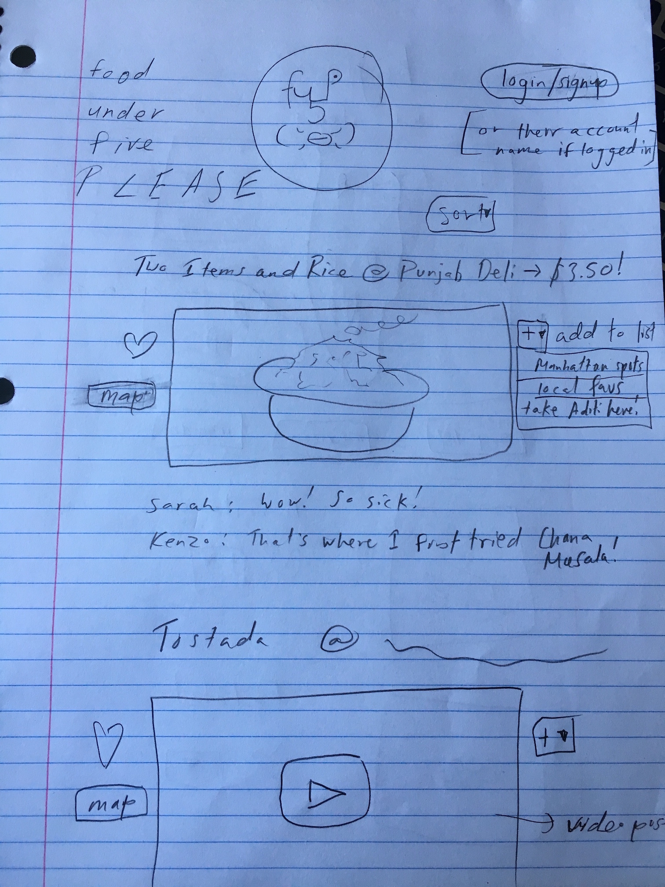
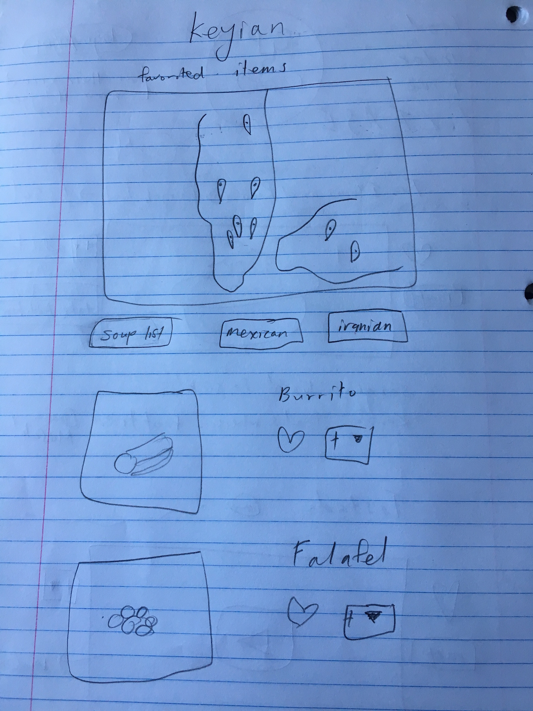
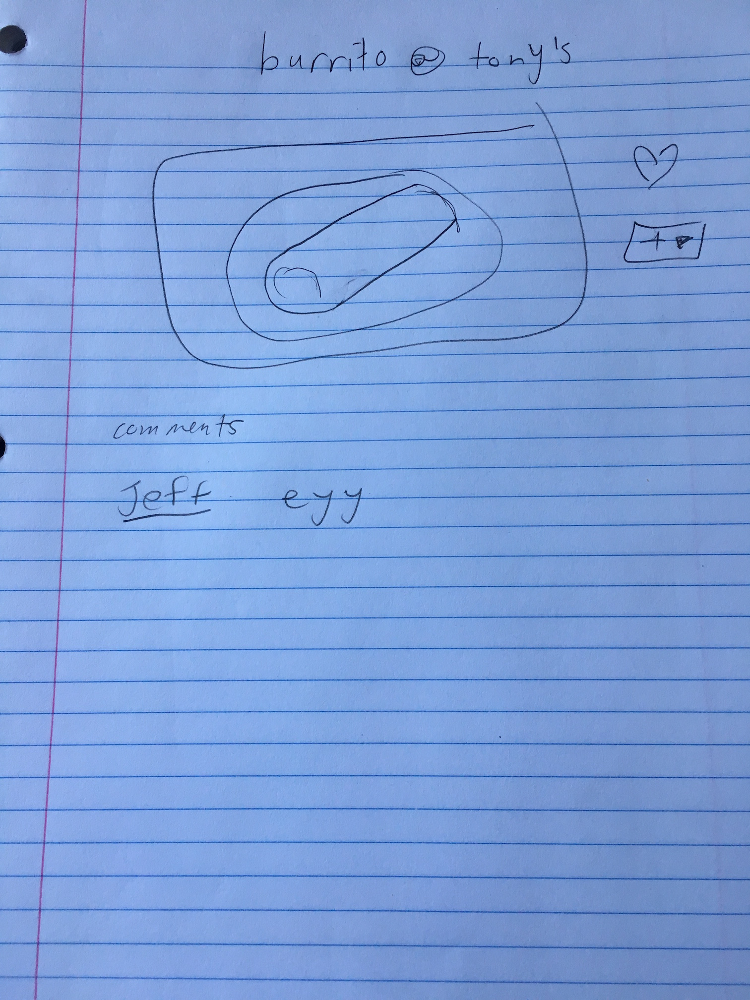
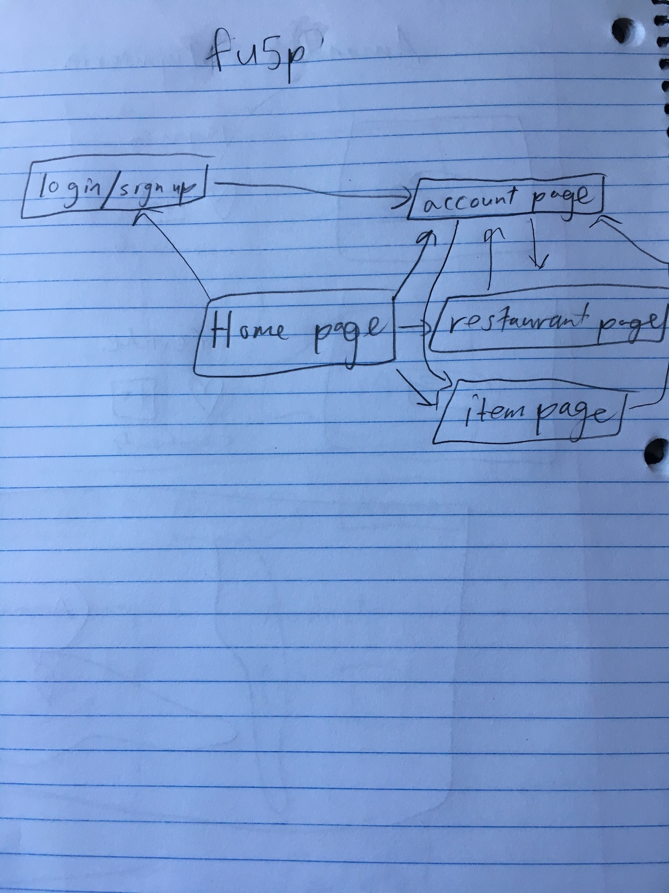

# Food Under Five Please (FU5P)


##Overview

There are web apps like yelp that differentiate *cheaper* restaurants from those that are more expensive, and there sure are list-sites like Thrillist that attempt to aggregate foods of a single category, like cheap foods, but there is no site dedicated to the simple idea of focusing on specific victual items at these restaurants, showcasing them for one particular characteristic alone: they are under five dollars.

Eating out in New York can be a headache for most working-class individuals; where do you go to get fed and not suffer a dent in your wallet? And does that place *have* to be fast food? New York and cities like it offer so many choices, that the problem isn't actually the existence of cheap food, it's the finding of it!

That's where FU5P saves the day. I originally thought of it a while back as a site that would have absurdist food reviews (that never actually reviewed the place in question) of places with an item under $5, which would then serve the double function of giving people ideas for cheap eats. Now I realize that, while these absurdist videos will only enhance the site, there are so many items that can be added to this site that it hardly makes any sense to wait for a video for each.

FU5P is a crowdsourced web app that allows users to add their favorite items under $5 in New York City's five boroughs (for now). I think a valid suspicion arises for any app that relies on crowdsourcing data, but I believe this can work for cheap food. The place you get your favorite cheap torta, or slice of pizza, or falafel, is a story about your own culture; it is something you show off because it represents how you relate to and experience New York City. People want to tell these stories about themselves and about the city, and this app gives them the opportunity to do so.

Items will be added with locations using the Google Maps and Autocomplete API, for consistency. They will also require a price, a restaurant title, an item title, and an image. There will need to be a report link due to this obviously inviting misuse.

Users can favorite items, which will be plotted onto a map on their account page, allowing for an easy capture of a cheap-eats-itinerary. They will also be able to create sub-lists which they can add to, in order to narrow down the plotted points on their map.

Videos will be posted as regularly as possible, documenting these locations (so vaguely) with a touch of humor.

Users will be able to comment on posts, discussing their stories and asking the poster questions.

Likely more features by next milestone!

## Data Model
Minimally, we'll have to store Users, Lists and Items

* users can have multiple lists
* each list can have multiple items

First draft schema:

```javascript
// users
// * our site requires authentication...
// * so users have a username and password
// * they also can have 0 or more lists
var User = new mongoose.Schema({
  // username, password provided by plugin
  lists:  [{ type: mongoose.Schema.Types.ObjectId, ref: 'List' }],
  comments: [{ type: mongoose.Schema.Types.ObjectId, ref: 'Comment'}]
});

var Item = new mongoose.Schema({
  name: {type: String, required: true},
  price: {type: Number, required: true},
  restaurant: {type: mongoose.Schema.Types.ObjectId, ref: 'Restaurant'},
  favorites: {type: Number, required: true},
  imgUrl: {type: String, required: true},
  videoUrl: {type: String, required: false}
},
{
  timestamps: true
});

var List = new mongoose.Schema({
  restaurants: [{ type: mongoose.Schema.Types.ObjectId, ref: 'Restaurant' }],
  name: {type: String, required: true},
  createdAt: {type: Date, required: true},
  updatedAt: {type: Date, required: true},
});

List.pre('save', function(next){
  now = new Date();
  this.updatedAt = now;
  if ( !this.createdAt ) {
    this.createdAt = now;
  }
  next();
});

var Comment = new mongoose.Schema({
  text: {type: String, required: true},
  user: {type: mongoose.Schema.Types.ObjectId, ref: 'User'}
});

var Restaurant = new mongoose.Schema({
  geoLocation: //look into google maps api more to find most suitable type (probably number array)
  name: {type: String, required: true},
  items: {type: mongoose.Schema.Types.ObjectId, ref: 'Item'}
})
```

## Wireframes

/ - home page



/account-slug - current user or other user's account page



/restaurant-slug- shows all items added for a particular restaurant


/item-slug- shows all item information for a particular item. possible description to be added.



## Site map

map of how this simple, template-utilizing website functions



## User stories

1. as a user, I can find cheap items to grub on in NYC
2. as a user, I can make lists of items that i love, or sort them by other categories of my choosing
3. as a user, I can watch non-sequitir review videos
4. as a user, I can comment on items and have a discussion with other users
5. as a user, I can share with others my favorite cheap items by adding my discoveries to fu5p!

## Research Topics

*(4 points) Perform client side form validation using custom JavaScript or JavaScript library
  *validating images and text length
  *also semantic validations, like is this a restaurant? is this capitalized?
  *price must be below 5

*(3 points) ReactJS
  *this is a cool way to learn react because it allows for state control of...
    *comments
    *favorites
    *lists
  *won't have to reload page to see new your new comment
  *helps with organization as more features are added

*(1 point) Google Maps API
  *Essential to the website, as it will show users where to get cheap eats.
  *Autocomplete
  *geolocation

*(1 point) Facebook Login API
  *easy to implement. people don't want to have yet another account
>>>>>>> 219e9604d5091b206f791c077b75d6cba4d35588
